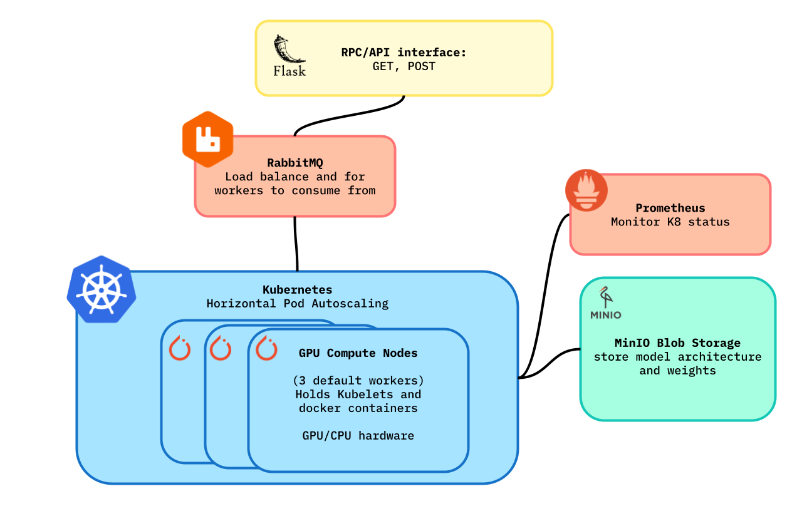

# Automatic Neural Network Training

<div align="center" >
  
  <br/>
    CSCI 4253 Final Project: Automatic Neural Network Training
  <br/>
  Kevin Buhler
  <br/>
</div>

### How to run

Ensure that Docker and Kubernetes are installed on your machine and then run:

```bash
pip install requirements.txt
chmod +x run.sh
./run.sh
```

This will run the Flask server at http://127.0.0.1:5000. The amount of workers is handled by Kubernete's horizontal pod autoscaling. You can configure the max amount of worker in `worker/autoscale.yaml`.

### Prometheus

If you want to set up the basic Prometheus server:

```bash
chmod +x prometheus.sh
./prometheus.sh
```

You can then go to http://localhost:9090/query to see the metrics dashboard.

### API Routes

Example:

```bash
POST /train:

Body parameters
- data: numpy batch data to train on
- labels: numpy batch labels
- model: upload a base64 encoded torchscript buffer
- lr: learning rate
- steps: training steps per batch
- epochs: number of times to iterate through entire data
- batch_size: number of samples per batch

curl -X POST -H "Content-Type: application/json" -d '{"lr": 0.1}' http://127.0.0.1:5000/train
```

Example:

```bash
GET /model/<string:hash_id>

curl --output output/run3.pth http://127.0.0.1:5000/model/62000807262c72a0af4c983b057077d22a44c2cca64205a7b1bce9753e3ee802
```

### Components

- Kubernentes/Prometheus
- PyTorch/TorchScript
- MinIO
- Flask
- RabbitMQ

### Interactions

Flask <-> RabbitMQ <-> Kubernetes worker <-> minio blob storage

### Presentation

Google Presentation: https://docs.google.com/presentation/d/1k9oQsrNGXxIDuBNtueDJWNB6viMZAbZzK02bsGo-EB4/edit?usp=sharing
